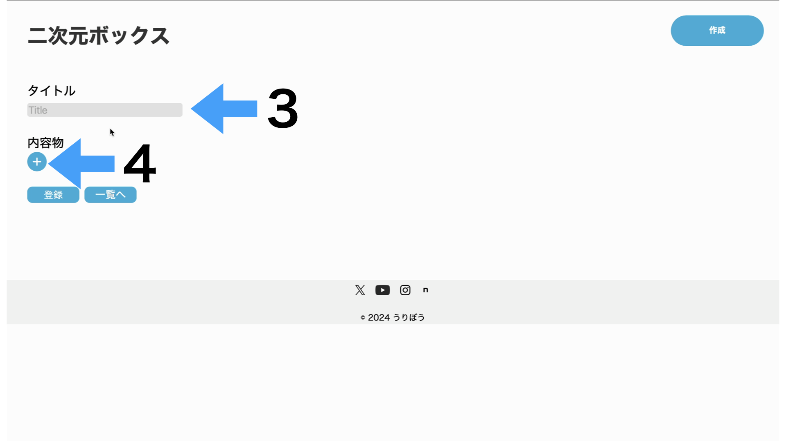

- [使い方](#使い方)
  - [「二次元ボックス」サイトへ](#二次元ボックスサイトへ)
  - [リストを作成](#リストを作成)
  - [タイトルと内容を入力](#タイトルと内容を入力)
  - [リスト項目の削除](#リスト項目の削除)
  - [内容の登録](#内容の登録)
  - [データの削除](#データの削除)
- [変更履歴](#変更履歴)

## 使い方

### 「二次元ボックス」サイトへ

二次元ボックスのURL(1)をクリック。

### リストを作成
どちらかのボタン(2)で新規作成。

### タイトルと内容を入力
タイトル欄(3)に箱など名前を、+ボタン(4)で内容物リストを追加していきます。

### リスト項目の削除
必要無くなったリストは-ボタン(5)で削除。

### 内容の登録
登録ボタン(6)で上記の内容をサーバーに登録。一覧へボタン(7)を押すと登録ずみの内容の一覧を表示できます。登録してない内容は削除されます。

### データの削除
編集ボタン(8)で登録内容の編集(2024/08/24現在未実装のため、編集不可)、削除ボタン(9)で登録内容の削除ができます。一覧へボタン(7)で一覧表示ができます。

## 変更履歴

githubのurl

[Git Hub: qr_content_list](https://github.com/ulibo-yuki/qr_content_list)

- 2024/08/24: デザインの変更